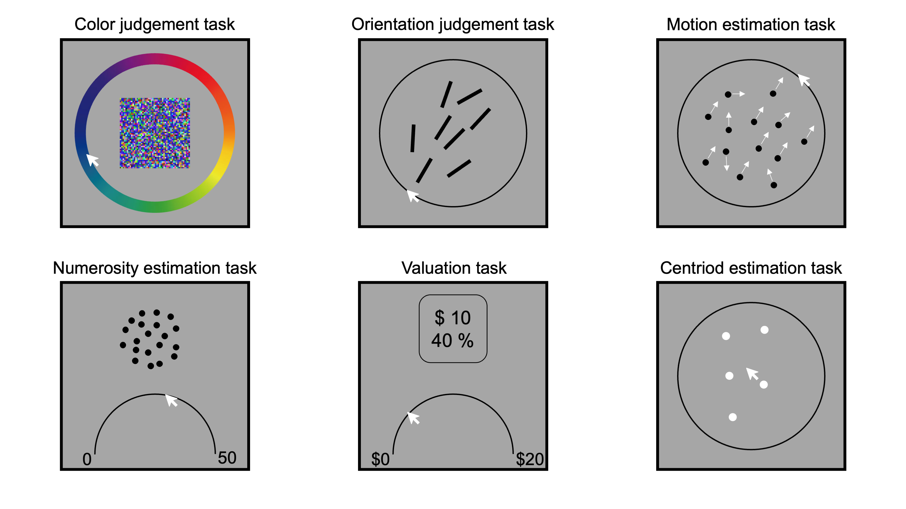

# CRDDM

## **Overview**
CRDDM is a Python package for modeling continuous-response decision tasks using **Continuous-Response Diffusion Decision Models (CRDDM)**.

The package provides fast and numerically stable likelihood evaluation for continuous-response diffusion models based on the integral equation method proposed by [Hadian Rasanan et al. (2025)](https://doi.org/10.3758/s13428-025-02810-3). 

CRDDM is designed for researchers in **cognitive science**, **mathematical psychology**, and **neuroscience** who study decision-making with continuous-response spaces. 

## **Features**
**1. Support for diverse continuous response scales:**

CRDDM supports a wide range of continuous-response scales commonly used in experimental research, including:

- Bounded one-dimensional scales (e.g., arcs or sliders),
- Circular scales (e.g., color wheels),
- Two-dimensional scales (e.g., 2D planes).

Examples of continuous-response decision tasks are illustrated below:

**2. Time-dependent decision thresholds:**

CRDDM supports diffusion models with time-dependent decision thresholds and enables likelihood estimation for models with arbitrary threshold dynamics. Specifically, the package includes:

- Fixed threshold,
- Linear collapsing threshold,
- Exponential collapsing threshold,
- Hyperbolic collapsing threshold,
- User-defined threshold functions.

This flexibility allows researchers to model urgency signals and dynamic decision boundaries in a principled way.

---
## **Diffusion models of continuous-response taks**

CRDDM includes four classes of multi-dimensional diffusion models, tailored to different response geometries:

- **Circular Diffusion Models** for experiments with circular response scales,
- **(Hyper-)Spherical Diffusion Models** for experiments with circular response scales,
- **Projected Spherical Diffusion Models** for experiments with one-dimensional bounded scales,
- **Projected Hyper-spherical Diffusion Models** for experiments with two-dimensional bounded scales.

---
## **Credits**

This package was developed by me, [Amir Hosein Hadian Rasanan](https://scholar.google.com/citations?hl=en&user=qbOoaykAAAAJ),
with getting support from [Dr. Nathan J Evans](https://scholar.google.com/citations?user=2hG7r90AAAAJ&hl=en) and [Prof. Dr. Jörg Rieskamp](https://scholar.google.com/citations?user=6Y5X1xUAAAAJ&hl=en). 

When using this package or part of the code for your own research, I ask you to cite us:

> Hadian Rasanan, A. H., Evans, N. J., and Rieskamp, J. (in prepration). Modeling Continuous-response Decisions with Multi-dimensional Diffusion Processes: A Tutorial

*Also don't forget to cite the original paper for each model.* 

- **Circular Diffusion Model**: Smith, P. L. (2016). Diffusion theory of decision making in continuous report. *Psychological Review*, 123(4), 425–451. [https://doi.org/10.1037/rev0000023](https://doi.org/10.1037/rev0000023)
- **Hyper-spherical Diffusion Model**: Smith, P. L., & Corbett, E. A. (2019). Speeded multielement decision-making as diffusion in a hypersphere: Theory and application to double-target detection. *Psychonomic Bulletin & Review*, 26(1), 127-162. [https://doi.org/10.3758/s13423-018-1491-0](https://doi.org/10.3758/s13423-018-1491-0)
- **Projected Spherical Diffusion Model**: Hadian Rasanan, A. H., Olschewski, S., & Rieskamp, J. (in prepration) The Projected Spherical Diffusion Model: A Theory of Evidence Accumulation for Continuous Estimation Tasks
- **Multi-dimensional Diffusion Models with Collapsing Decision Threshold**: Hadian Rasanan, A. H., Evans, N. J., Amani Rad, J., & Rieskamp, J. (2025). Parameter estimation of hyper-spherical diffusion models with a time-dependent threshold: An integral equation method. *Behavior Research Methods*, 57(10), 283. [https://doi.org/10.3758/s13428-025-02810-3](https://doi.org/10.3758/s13428-025-02810-3)

---
## **Support**

If you have questions, encounter issues, or would like to contribute, please contact: [amir.h.hadian@gmail.com](mailto:amir.h.hadian@gmail.com)