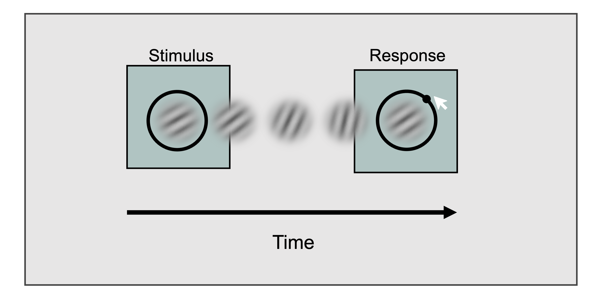
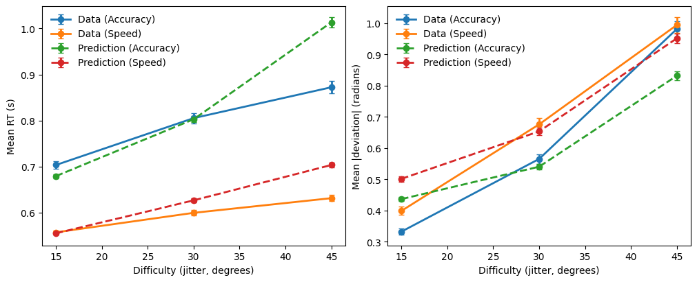

# Design Specification: Condition-Specific Parameters (Speed–Accuracy Tradeoff)


This tutorial demonstrates how to implement **design specifications** in CRDDM—that is, how experimental manipulations are translated into **condition-specific model parameters** within a single likelihood function.

In the example below (based on the accompanying notebook), we fit a **Circular Diffusion Model (CDM)**
to data from an orientation judgment task reported in [Kvam (2019)](https://doi.org/10.1037/xhp0000606).
In this task, participants viewed a dynamic Gabor patch and reported the **average orientation**
of the stimulus by clicking on a circular response scale:


<!--  -->

The experimental design includes two orthogonal manipulations:

- a **speed–accuracy trade-off** instruction (`isSpeed`),
- a **stimulus difficulty** manipulation (`jitter` ∈ {15, 30, 45} degrees).

To model these data, we specify a circular diffusion model with the following structure:

- the **decision threshold** is condition-specific, differing between speed and accuracy blocks;
- the **drift magnitude** varies across difficulty levels (indexed by jitter);
- the **drift angle** and **non-decision time (NDT)** are shared across all conditions.

This parameterization allows the model to capture systematic changes in response caution and evidence quality
induced by task instructions and stimulus difficulty, while maintaining a parsimonious representation of
shared decision dynamics.

---

## 1. Import required packages


```python
import numpy as np
import pandas as pd

from tqdm import tqdm

import seaborn as sns
import matplotlib.pyplot as plt

from scipy.optimize import differential_evolution

from CRDDM.utility.datasets import load_kvam2019
from CRDDM.Models.Circular import CircularDiffusionModel as CDM
```

---
## 2. Load the dataset


```python
data = load_kvam2019()

data.head()
```

|   Participant |   isSpeed |   jitter |   response |   deviation |      rt |
|--------------:|----------:|---------:|-----------:|------------:|--------:|
|           100 |         0 |       45 |    1.9217  |  -0.5391    | 1.2595  |
|           100 |         0 |       30 |    1.7845  |   0.32968   | 0.86939 |
|           100 |         0 |       15 |    0.26625 |  -0.30658   | 0.8009  |
|           100 |         0 |       30 |    2.157   |   0.15855   | 1.0019  |
|           100 |         0 |       15 |    1.7277  |   0.0072374 | 2.364   |


This dataset includes:

- `Participant`: participant identifier,
- `isSpeed`: instruction condition (1 = speed, 0 = accuracy),
- `jitter`: stimulus difficulty (15, 30, 45 degrees),
- `deviation`: signed angular response deviation (radians),
- `rt`: response time (seconds).
---

## 3. Define the likelihood with design-specific parameters

The likelihood function below constructs **trial-wise drift vectors** based on the experimental
design and routes trials to condition-specific thresholds depending on the instruction condition.

### Model specification

- **Two decision thresholds:** `threshold_speed` and `threshold_accuracy`
- **One non-decision time:** `ndt`
- **One drift direction:** parameterized by a drift angle `drift_angle`
- **Three drift magnitudes:** one per jitter level (15, 30, 45)


```python
def negative_log_likelihood(params, rt, theta, isSpeed, jitter, model):
    threshold_speed = params[0]
    threshold_accuracy = params[1]
    ndt = params[2]
    drift_angle = params[3]

    # Drift direction is shared across conditions
    drift_direction = np.array([np.cos(drift_angle), np.sin(drift_angle)])

    # Drift magnitude depends on jitter
    drift_magnitudes = np.empty(rt.shape)
    drift_magnitudes[jitter == 15] = params[4]
    drift_magnitudes[jitter == 30] = params[5]
    drift_magnitudes[jitter == 45] = params[6]

    # Trial-wise drift vectors
    drift_vectors = np.outer(drift_magnitudes, drift_direction)

    # Condition-specific thresholds (speed vs accuracy)
    logpdf_speed = model.joint_lpdf(
        rt[isSpeed == 1],
        theta[isSpeed == 1],
        drift_vectors[isSpeed == 1, :],
        ndt,
        threshold_speed,
    )

    logpdf_accuracy = model.joint_lpdf(
        rt[isSpeed == 0],
        theta[isSpeed == 0],
        drift_vectors[isSpeed == 0, :],
        ndt,
        threshold_accuracy,
    )

    return -np.sum(logpdf_speed) - np.sum(logpdf_accuracy)
```

---

## 4. Set parameter bounds and fit the model per participant


```python
param_names = ['threshold_speed', 
               'threshold_accuracy',
               'ndt', 
               'drift_angle',
               'drift_magnitude15',
               'drift_magnitude30',
               'drift_magnitude45']


# Parameter bounds
bounds = [
    (0.05, 5.0),   # threshold speed
    (0.05, 5.0),   # threshold accuracy
    (0.0, 1.0),    # non-decision time
    (-np.pi, np.pi),    # drift angle
    (0, 8.0),   # drift magnidute (length) for jitter=15
    (0, 8.0),   # drift magnidute (length) for jitter=30
    (0, 8.0),   # drift magnidute (length) for jitter=45
]
```


```python
model = CDM(threshold_dynamic="fixed")

estimation_rows = []
```


```python
# Estimate model parameters separately for each participant
for sbj in tqdm(data.Participant.unique()):
    sbj_data = data[data['Participant']==sbj].reset_index(drop=True)
    
    # Optimize the negative log-likelihood function
    result = differential_evolution(
                negative_log_likelihood,
                bounds=bounds,
                args=(sbj_data["rt"].values, 
                      sbj_data["deviation"].values,
                      sbj_data["isSpeed"].values,
                      sbj_data["jitter"].values, model),
    )
    
    k = len(result.x) # number of free parameters
    n = sbj_data.shape[0] # number of trials for the participant
    nlpdf = result.fun # optimized negative log-likelihood value
    
    # store the goodness of fit criterion and estimated parameters for each subject
    row = {
        "Participant": sbj, 
        "nlpdf": nlpdf, 
        "AIC": 2 * nlpdf + 2 * k, 
        "BIC": 2 * nlpdf + k * np.log(n)
    }
    row.update(dict(zip(param_names, result.x)))
    
    estimation_rows.append(row)
```

    100%|███████████████████████████████████████████| 12/12 [00:12<00:00,  1.06s/it]


```python
estimation_data = pd.DataFrame(estimation_rows)
estimation_data
```

|   Participant |    nlpdf |      AIC |      BIC |   threshold_speed |   threshold_accuracy |      ndt |   drift_angle |   drift_magnitude15 |   drift_magnitude30 |   drift_magnitude45 |
|--------------:|---------:|---------:|---------:|------------------:|---------------------:|---------:|--------------:|--------------------:|--------------------:|--------------------:|
|           100 | 335.535  |  685.07  |  715.837 |          0.866757 |             1.50936  | 0.440777 |   -0.0157439  |             3.59821 |             2.76672 |            1.54547  |
|           101 | 283.352  |  580.704 |  609.877 |          1.0362   |             1.33893  | 0.416766 |   -0.0199686  |             3.94078 |             2.66761 |            1.40861  |
|           110 | 557.592  | 1129.18  | 1158.34  |          0.978971 |             1.27506  | 0.337027 |    0.0578871  |             2.92682 |             1.52246 |            0.730462 |
|           120 | 471.097  |  956.194 |  985.189 |          0.905203 |             1.53838  | 0.362234 |    0.0143186  |             2.69224 |             1.7259  |            1.05211  |
|           130 | 248.978  |  511.956 |  541.172 |          0.715614 |             0.889673 | 0.2799   |    0.0284188  |             3.0901  |             2.15851 |            1.09002  |
|           140 |  93.2438 |  200.488 |  229.704 |          0.999547 |             1.04782  | 0.388389 |    0.00383741 |             4.87936 |             3.23159 |            1.58084  |
|           150 | 196.158  |  406.315 |  435.532 |          0.917433 |             0.870011 | 0.332569 |    0.0459289  |             3.89978 |             2.50724 |            1.43862  |
|           170 | 282.323  |  578.647 |  607.805 |          0.835069 |             1.09277  | 0.254983 |    0.0846156  |             3.43038 |             2.25192 |            1.16668  |
|           180 | 462.984  |  939.967 |  969.11  |          0.971128 |             1.69997  | 0.258889 |   -0.127637   |             2.87725 |             2.02574 |            1.12141  |
|           190 | 277.391  |  568.781 |  597.639 |          0.840641 |             1.94945  | 0.316306 |   -0.0698122  |             3.43441 |             2.26668 |            1.34496  |
|           200 | 427.305  |  868.61  |  897.619 |          0.883803 |             1.09596  | 0.232506 |    0.0471421  |             2.91083 |             2.05821 |            1.05827  |
|           210 | 303.888  |  621.777 |  650.876 |          0.894596 |             1.1362   | 0.368374 |   -0.0905744  |             3.27711 |             2.2957  |            1.26796  |


---

## 5. Model-based prediction (posterior predictive simulation)

We next perform **posterior predictive simulations** using the fitted parameters.
By comparing summary statistics from the observed data and model-generated data,
we assess whether the model captures systematic effects of task instructions
and stimulus difficulty.


```python
n_sample_condition = 200
predictions = []

for sbj in tqdm(data.Participant.unique()):
    # model's parameters for each subject
    prms = estimation_data[estimation_data["Participant"] == sbj].iloc[0]

    drift_dir = np.array([np.cos(prms["drift_angle"]), 
                          np.sin(prms["drift_angle"])])

    for jitter in [15, 30, 45]:
        drift_mag = prms[f"drift_magnitude{jitter}"]
        drift_vec = drift_mag * drift_dir

        # Speed condition
        speed_df = model.simulate(
            drift_vec,
            prms["ndt"],
            threshold=prms["threshold_speed"],
            n_sample=n_sample_condition,
        )
        speed_df["isSpeed"] = 1
        speed_df["jitter"] = jitter
        speed_df["Participant"] = sbj

        # Accuracy condition
        acc_df = model.simulate(
            drift_vec,
            prms["ndt"],
            threshold=prms["threshold_accuracy"],
            n_sample=n_sample_condition,
        )
        acc_df["isSpeed"] = 0
        acc_df["jitter"] = jitter
        acc_df["Participant"] = sbj

        predictions.append(pd.concat([speed_df, acc_df], ignore_index=True))

model_prediction = pd.concat(predictions, ignore_index=True)
model_prediction.head()
```

    100%|███████████████████████████████████████████| 12/12 [00:02<00:00,  4.92it/s]


|       rt |   response |   isSpeed |   jitter |   Participant |
|---------:|-----------:|----------:|---------:|--------------:|
| 0.662777 |   0.270706 |         1 |       15 |           100 |
| 0.578777 |  -0.612121 |         1 |       15 |           100 |
| 0.568777 |   0.182161 |         1 |       15 |           100 |
| 0.661777 |  -0.752912 |         1 |       15 |           100 |
| 0.714777 |  -0.727197 |         1 |       15 |           100 |


## 6. Compare summary measures

A common approach is to compare mean RT and mean absolute deviation across conditions:


```python
data_plot = data.copy()
data_plot["abs_dev"] = np.abs(data_plot["deviation"])

pred_plot = model_prediction.copy()
pred_plot["abs_dev"] = np.abs(pred_plot["response"])
```


```python
# Helper: compute mean + SEM
def summarize(df, value_col, source_name):
    g = (
        df.groupby(["jitter", "isSpeed"])[value_col]
        .agg(mean="mean", sem="sem")
        .reset_index()
    )
    g["source"] = source_name
    g["metric"] = value_col
    return g
```


```python
def plot_metric(ax, metric, ylabel):
    sub = summary[summary["metric"] == metric].copy()

    # plot each (source × condition) as a separate line with error bars
    for (source, condition), sdf in sub.groupby(["source", "condition"]):
        sdf = sdf.sort_values("jitter")
        ax.errorbar(
            sdf["jitter"],
            sdf["mean"],
            yerr=sdf["sem"],
            marker="o",
            linewidth=2,
            linestyle="-" if source == "Data" else "--",
            label=f"{source} ({condition})",
            capsize=3,
        )

    ax.set_xlabel("Difficulty (jitter, degrees)")
    ax.set_ylabel(ylabel)
    ax.legend(frameon=False)
```


```python
summary = pd.concat(
    [
        summarize(data_plot, "rt", "Data"),
        summarize(data_plot, "abs_dev", "Data"),
        summarize(pred_plot, "rt", "Prediction"),
        summarize(pred_plot, "abs_dev", "Prediction"),
    ],
    ignore_index=True,
)

summary["condition"] = summary["isSpeed"].map({0: "Accuracy", 1: "Speed"})
summary["jitter"] = summary["jitter"].astype(int)
```

We focus on two key summary measures: **mean response time**, which indexes response *speed*, and **mean absolute response deviation**, which quantifies response *precision*. Together, these measures capture the speed–accuracy trade-off and characterize how task difficulty influences both response speed and response precision in continuous-report tasks.


```python
fig, axes = plt.subplots(1, 2, figsize=(10, 4), constrained_layout=True)

plot_metric(axes[0], "rt", "Mean RT (s)")
plot_metric(axes[1], "abs_dev", "Mean |deviation| (radians)")

plt.show()
```


    

    


---

## Notes

- This pattern—mapping design factors to different model parameters—scales to more complex designs
  (e.g., stimulus-specific drifts, participant-level covariates, hierarchical extensions).
- The key idea is to construct **trial-wise parameters** (like `drift_vectors`) and to route trials
  to condition-specific parameters (like thresholds) inside the likelihood.
  
---

## References

Kvam, P. D. (2019). Modeling accuracy, response time, and bias in continuous orientation judgments. *Journal of Experimental Psychology: Human Perception and Performance*, 45(3), 301–318. [https://doi.org/10.1037/xhp0000606](https://doi.org/10.1037/xhp0000606)
